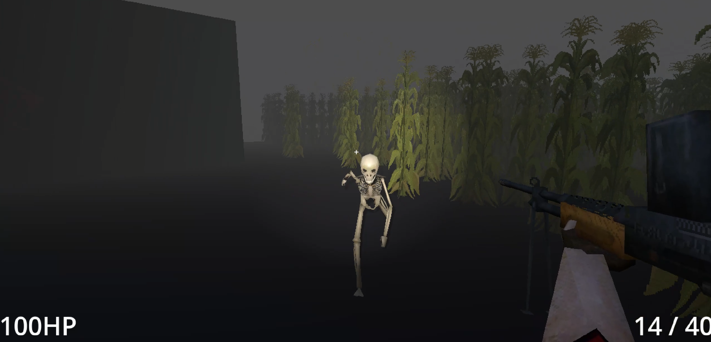

# 3D FPS Godot Game (Field of Bones)

 ![[CC BY-NC 4.0]](https://img.shields.io/badge/Assets-CC_BY--NC_4.0-lightgrey.svg) 

> _A slow-paced 3D FPS in the making, featuring a farmer protagonist fending off skeletons that encroach on their farm. Horror, action, FPS._

> **This is a very early prototype and a work in progress.** Intended for learning, experimentation, and showcasing collaborative development.

## Preview

## About the Project

This project is an early-stage prototype for a first-person horror shooter game. It was created collaboratively by a small team of friends to eventually create a game we've always wanted to make. 

We've always wanted to work on a game together, and with our combined skills, we're slowly cobbling something together that is vaguely resembling a game.

Currently, the prototype focuses on building and testing core gameplay systems before expanding into full level design, story, or polish.

## Current Features

✅ - Implemented

🛠️ - In Progress / Partial

❌ - Planned / Not Yet Implemented

### Player Systems
- ✅ Walking, sprinting, jumping, crouching
- ✅ Flashlight toggle
- ✅ Gun inventory system (pickup, persistent ammo counts, ammo type sharing)
- ✅ Reloading mechanics
- ✅ Weapons with unique albeit simple properties (Burst fire shotgun, automatic assault rifle, semi-automatic pistols)
- ✅ Ammo pick-ups
- 🛠️ Refactoring player controller into a state machine

### UI
- 🛠️ Player HUD (Health, Ammo, Crosshair, Scope)
- 🛠️ Contextual pop-ups (Item/Weapon Pickups)
- ❌ Inventory UI

### Enemy AI
- ✅ Animated skeleton enemy (placeholder animations)
- ✅ Wandering behaviour
- ✅ Player detection + chase logic
- ✅ Melee attack at close range 
- ✅ Takes damage when shot and dies upon running out of hit points
- 🛠️ Running attack
- ❌ More complex behaviours (Searching, Hiding, etc.)

### Environment
- ✅ Basic level blockout for testing systems
- 🛠️ Lighting
- ❌ Full assets and level design

### Sound & Music
- ✅ Player sounds, including walking, running, item pick ups, jump and fall
- ✅ Gun sounds, including firing and reloading
- ✅ Ambient sound effects, including wind rustling
- ✅ Ambient music for atmosphere
- ✅ Enemy SFX, including walking and running

## Tech Stack

- **Engine:** Godot (Ver 4.2.2 stable)
- **Language:** GDScript
- **AI:** Custom Finite State Machine (FSM) behaviour & Navigation provided by Godot's Navmesh and Agent nodes
- **Animation:** Godot Animation Controller
- **Version Control:** Git & GitHub Desktop

## How to Run

1. Clone the repository
2. Open the project in Godot 4.x.x
3. Run the Main scene

## Credits
- **Patrikas Lukosius** - Core programming (movement, inventory, AI), project setup and project management
- **Boz Squires** - 3D modelling, animation, textures
- **Robin Gairdner** - Sound design, sound implementation, composer

## Licensing

### Code

All source code in this repository is released under the MIT License

### Art, Models, And Animations
![[CC BY-NC 4.0]](https://img.shields.io/badge/Assets-CC_BY--NC_4.0-lightgrey.svg)
All 3D models, textures, 2D assets, and animations are © Boz Squires, and licensed under **CC BY-NC 4.0**

### Sound and Music
 
All sound effects and ambient tracks © Robin Gairdner and licensed under **CC BY-NC 4.0**.

## Future Plans
While our work on this project is sporadic, we're still developing this game and are planning a variety of features, some of which may not necessarily end up in any final builds (if we get there haha). Some of the features we've discussed include:
- Grid style inventory system (i.e. Resident Evil 4)
- Soft-aiming system (i.e. Helldivers 2)
- More complex enemy behaviour and types
- More weapons (melee & ranged)
- Level design and polish
- The rest of the game

